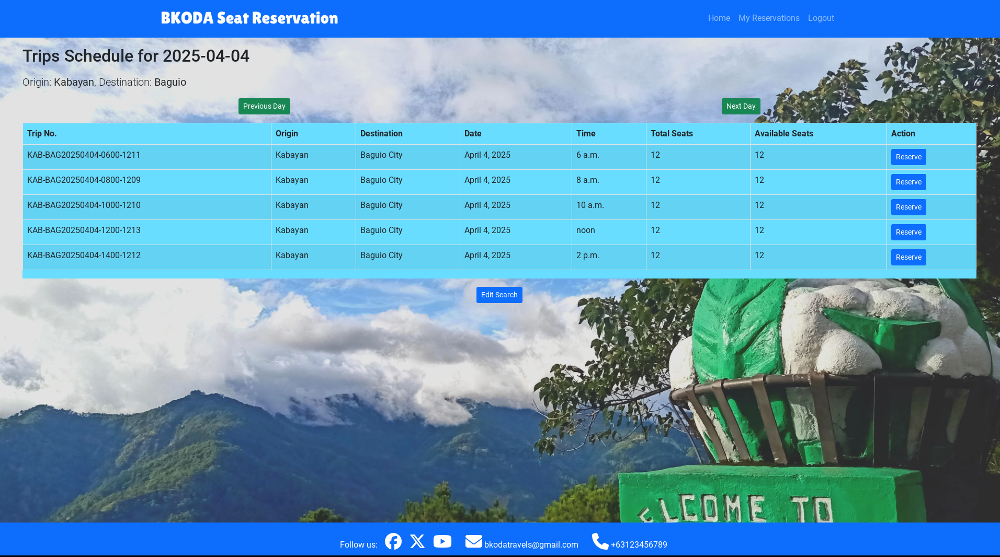
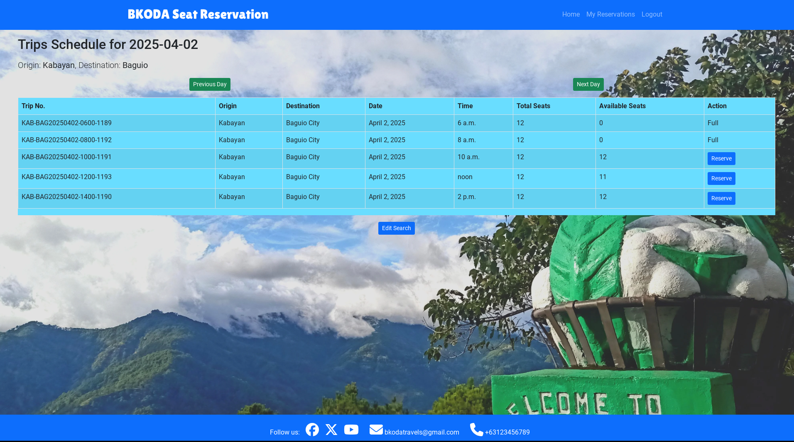
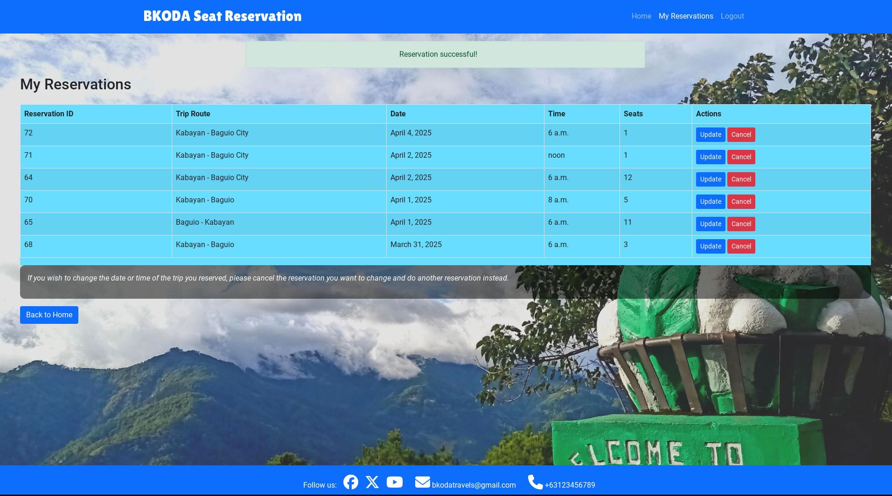
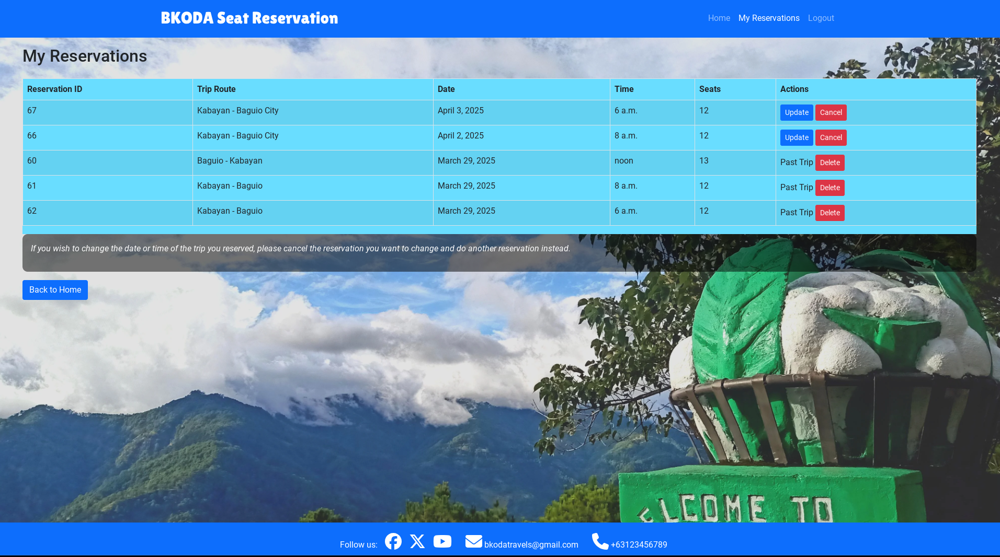
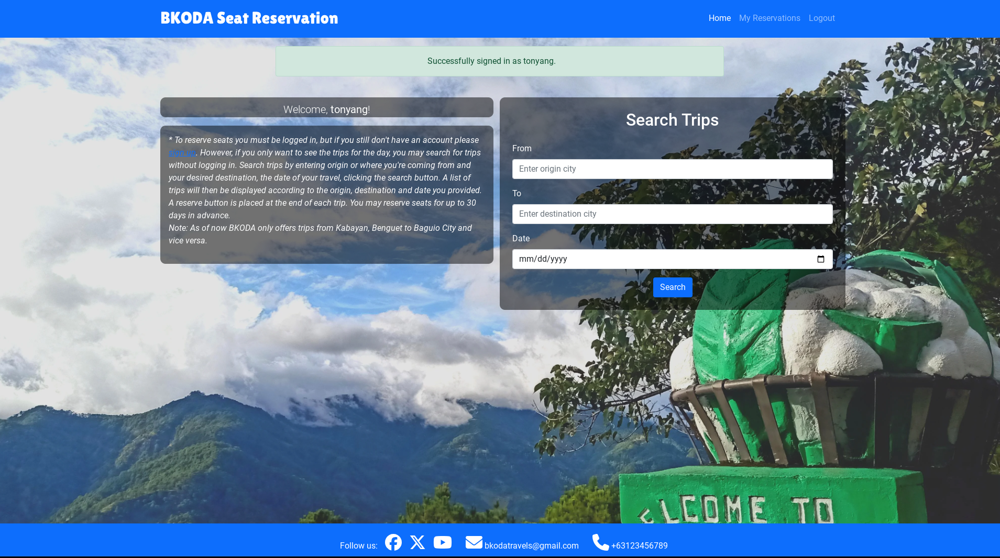
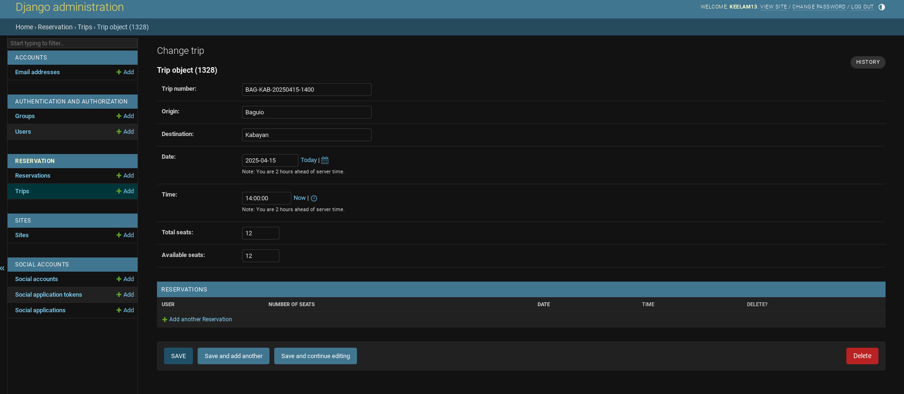

# Testing

## Manual Testing

Testing was done throughout site development, for each feature before it was merged into the master file.

Usability was tested with the below user acceptance testing, sent to new users to ensure testing from different users, on different devices and browsers to ensure issues were caught and where possible fixed during development.

|     | User Actions           | Expected Results | Y/N | Comments    |
|-------------|------------------------|------------------|------|-------------|
| Logo        |                        |                  |      |             |
| 1           | Clicks the logo or Home button in navbar.| Redirect to home page.| Y | | 
| Sign Up     |                        |                  |      |             |
| 1           | Click on Register button on the navbar| Redirection to Sign Up page | Y |          |
| 2           | Click on the sign up link in the instruction box | Redirection to Sign Up page | Y |          |
| 3           | Click on the signin link in the form | Redirection to Login page | Y |          |
| 4           | Enter valid email | Field will only accept email address format | Y |          |
| 5           | Enter valid username | Field will only accept no more than 50 characters | Y |          |
| 6           | Enter valid password | Field will only accept secure passwords | Y |          |
| 7           | Enter valid password confirmation | Field will only accept the same password from the previous field | Y |          |
| 8          | Click on the Sign Up button | Redirects to Home Page with pop-up confirming successful sign in. Resgister and Log In in navbar is now replaced by Logout | Y |          |
| 9          | Sign In with the same email/username and password | Redirects to Home Page with pop-up confirming successful sign in. Resgister and Log In in navbar is now replaced by Logout | Y |          |
| 10          | Click Logout | Takes user to log out page to confirm logout | Y |          |
| 11          | Click  SIgn out button  | Redirects user to home page | Y |          |
| Log In      |                        |                  |      |             |
| 1           | Click on Login button | Redirection to Login page | Y |          |
| 2           | Click on the SignUp link in the form | Redirection to SignUp page | Y |          |
| 3           | Enter valid email or username | Field will only accept email address format | Y |          |
| 4           | Enter valid password | Field will only accept secure passwords | Y |          |
| 5           | Click on the Sign In button | Redirect user to Home page with pop-up confirming successful sign in. Get started button now missing in main nav, replaced by Menu | Y |          |
| 5           | Clicks "Forgot Password" instead of "Sign In" | Redirects user to forgot password page | Y |          |
| My Reservation |                     |                  |      |             |
| 1           | Logged in User clicks the My Reservation link in the navbar.| Redirected to the users Reservation lists.| Y  |   |
| 2           | Not logged in user clicks the My Reservation link in the navbar.| Redirected to sign in page.| Y  |   |
| Search Trips|                        |                  |      |              |
| 1           | Enter Origin in Field. | Form will suggest origin, accepts only the available origins in the data.| Y  |   |
| 2           | Enter Destination in Field. | Form will suggest destinations, accepts only the available destination in the data.| Y  |   |
| 3           | Clicks on the calendar icon beside the Date field.| Caledar pops up for user to choose date.| Y  |   |
| 4           | Enter date in the date field.| Date format must be as the label suggests.| Y  |   |
| 5           | Clicks Search Trips button.| Takes to Trip List based on the search details.| Y  |   |
| Reservation | | | | |
| 1            | Logged in user clicks reserve button.| Takes to reservation form.| Y| |
| 2            | Not logged in user clicks reserve button.| Redirects to sign in page.| Y | |
| 3            | Enters number of seats and clicks reserve seats button.| Raises error if number is equal or less than 0, or in higher than available seats, else redirects to My Reservation with pop-up confirming successful Reservation.| Y | |
| 4            | Clicks the Back to trips button in the reservation form.| Calls confirmation.|Y | |
| 5            | Clicks "No".| Removes the Confirmation dialog.| Y | |
| 6            | Clicks "OK".| Redirects to the Trip list.| Y | |
| 7            | Clicks Previous Day button.| Takes to previous day trips, but if it's in the past it will raise an error.| Y | |
| 8            | Clicks the Next Day button.| Takes to next day trips, but will raise error if the are no trips available.| Y | |
| 9            | Clicks Edit Search button. | Rdirects to home page.| Y | |
| My Reservations | | | | |
| 1            | Clicks Update button.| Takes to Reservation Form for editing number of seats.| Y | |
| 2            | Clicks Reserve Seats in the form.| Number of seats is updated with pop-up confirming successful update.| Y | |
| 3            | Clicks Cancel/Delete button.| Takes to Cancelation confirmation dialog.| Y | |
| 4            | Clicks the "No" button.| Redirects to My Reservations.| Y | |
| 5            | Clicks "Yes" button.| Redirect to My Reservations with pop-up confirming successful cancelation.| Y | |
| 6            | Clicks Back to Home button.| Redirects to Home Page.| Y | |
| 7            | Trip goes the in past.| Update button will be replaced by "Past Trip", and Cancel button will be replaced with Delete button.| Y | |
| Social Media Icons | | | | |
| 1            | Click any of the icons.| Takes to the SocMed account.| Y | |
| 2            | Click email.| Opens email.| Y | |
| 3            | Clicks Phone Number.| Tries to call the Number.| Y | |

---

## Testing User Story

### **First Time Visitor Goals**

|As a Passenger, I want to easily search for available routes and schedules, to be able to decide which trips to take.| User can see a list of scheduled trips for the dates entered in the search.||

|As a Passenger, I want to view a visual representation of seat availability, for me to check if I can still be accommodated, especially when reserving for multiple passengers.| A tabular form of trips with details such as Trip Number, Routes, Date, Time, Total Seats, and Available Seats displayed upon search.||

|As a Passenger, I want to reserve a seat online, so I don't have to be physically present at the terminal to do so.| User will receives a booking confirmation.||

|As a Passenger, I want to view and manage my reservation to cancel or change the number of seats reserved.| As a logged in user, I can cancel my booking and/or change the number of seats reserved.||

|As a  Passenger,  I want to register an account to be able to see and manage my reservation.| Given an email a user can register an account and then is able to log in and eventually logout of the app.||

### **Frequent Visitor Goals**

As a Frequent Passenger, I want to be able to easily log in to and log out from my account, so that I can have more access to the app's features.| The user is able to log in and log out with a success confirmation.|||

### **Administrator Goals**

|As an Administrator I want to add scheduled trips and if needed delete them to cater to the demands for transportation.|Administrator is able to schedule more trips and delete scheduled trips when needed.||

|As an Administrator I want to see an overview of the reservations to check if scheduled trips are being booked.|Administrator can see the list of bookings per scheduled trip.||
---

## Validation:
### HTML Validation:

- [Full HTML Validation Report](documentation/validation/html_validation.pdf)

- No errors or warnings were found when passing through the official [W3C](https://validator.w3.org/) validator. This checking was done manually by copying the view page source code (Ctrl+U) and pasting it into the validator.

### CSS Validation:

- [Full CSS Validation Report](documentation/validation/validation_css.png)

- No errors or warnings were found when passing through the official [W3C (Jigsaw)](https://jigsaw.w3.org/css-validator/#validate_by_uri).

### JS Validation:

- [Full JS Validation Report](documentation/validation/validation_js.png)

- No errors or warning messages were found when passing through the official [JSHint](https://www.jshint.com/) validator. 

### Python Validation:

* Admin.py
- [Full Python Validation - Admin](documentation/validation/validation-pep8-admin.png)

* Apps.py
- [Full Python Validation - Apps](documentation/validation/validation-pep8-apps.png)

* ASGI.py
- [Full Python Validation - ASGI](documentation/validation/validation-pep8-asgi.png)

* Forms.py
- [Full Python Validation - Forms](documentation/validation/validation-pep8-forms.png)

* Manage.py
- [Full Python Validation - Manage](documentation/validation/validation-pep8-manage.png)

* Models.py
- [Full Python Validation - Models](documentation/validation/validation-pep8-models.png)

* Setting.py
- [Full Python Validation - Settings](documentation/validation/validation-pep8-settings.png)

* URL.py
- [Full Python Validation - URL](documentation/validation/validation-pep8-urls.png)

* Views.py
- [Full Python Validation - Views](documentation/validation/validation-pep8-views.png)

* WSGI.py
- [Full Python Validation - WSGI](documentation/validation/validation-pep8-wsgi.png)

- No errors were found when the code was passed through CI Python Linter [online validation tool](https://pep8ci.herokuapp.com/#). This checking was done manually by copying python code and pasting it into the validator.

---
## Lighthouse Report

### Home Page

### Login Page

### Logout Page

### Forgot Password Page

### Access Limited Page

---

## Compatibility

Testing was conducted on the following browsers;

- Brave;
- Chrome;
- Firefox;

[Compatibility Report](documentation/compatibility/compatibility.pdf)

---

# Responsiveness

The responsiveness was checked manually by using devtools (Chrome) throughout the whole development. It was also checked with [Responsive Viewer](https://chrome.google.com/webstore/detail/responsive-viewer/inmopeiepgfljkpkidclfgbgbmfcennb/related?hl=en) Chrome extension.

[Responsiveness Report](documentation/responsiveness/responsiveness.pdf)

---